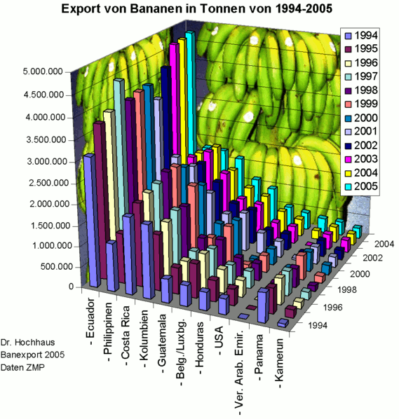
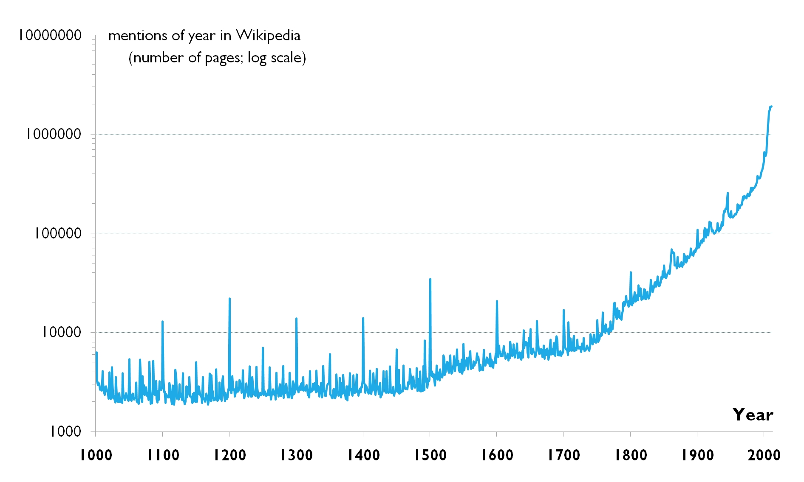
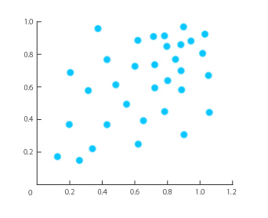
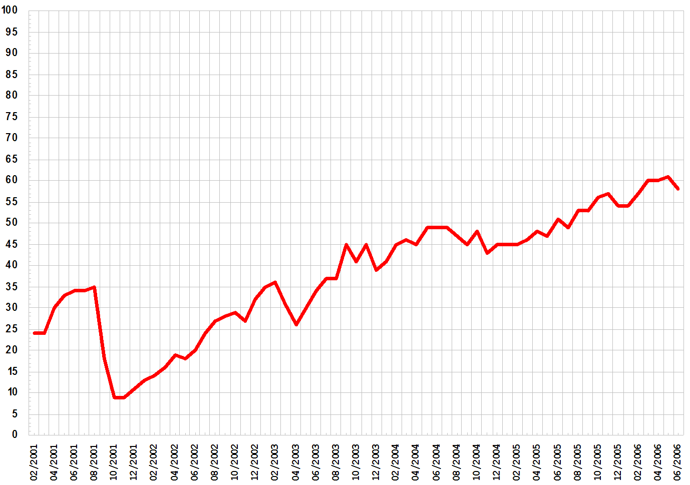
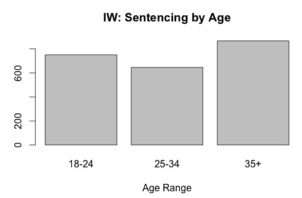
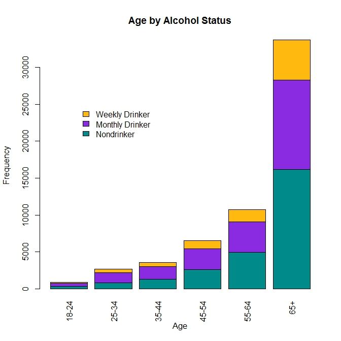
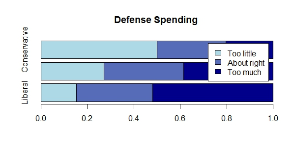
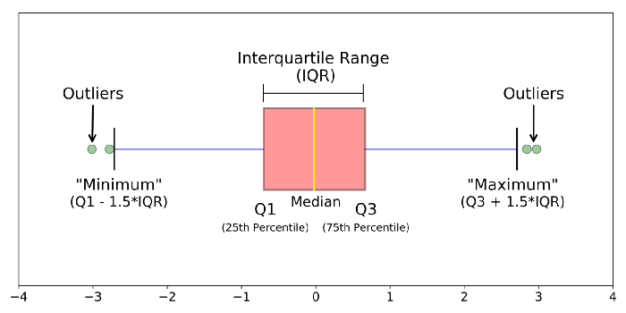

```{r setup}
knitr::opts_chunk$set(message = FALSE, warning = FALSE)
```

## ¿Qué vamos a hacer?

La visualización es una parte esencial de cualquier proyecto de datos. Nos ayuda a comprender la estructura de nuestro dataset y a detectar patrones y outliers.

En este primer fastbook, aprenderás los conceptos básicos de la visualización de datos y crearás los primeros gráficos utilizando ggplot.

## 1. Introducción a la visualización de datos

### ¿Para qué sirve la visualización?

Durante las asignaturas previas, has aprendido a manejar datos en tablas. A filtrarlos, agruparlos, sacar estadísticas, transformarlos... Pero una de las herramientas más potentes que tenemos para explorar y comunicar propiedades de nuestro dataset es la visualización.

Pongamos que trabajamos sobre un dataset con información de pingüinos. Si no lo tenemos ya descargado, lo hacemos:

```{r}
# Descomenta la siguiente línea en el caso de que no tengas instalado
# el paquete palmerpenguins, que tiene el dataset que vamos a usar
# remotes::install_github("allisonhorst/palmerpenguins")

# Lo cargamos
library(palmerpenguins)
```

En este punto, no sabemos nada de este dataset. Tenemos herramientas vinculadas con el tratamiento de tablas, como `summary`, que nos da conteos y estadísticas de las columnas.

```{r}
summary(penguins)
```

Una forma alternativa de explorar nuestro dataset, sería empezar a hacerle preguntas mediante gráficas. P.e. si queremos ver qué especies de pingüinos y en qué cantidad aparecen, podemos hacer:

```{r}
barplot(table(penguins$species))
```

> Ejecuta `table(penguins$species)` para ver este resultado intermedio, que es el que le pasamos a `barplot`. También consulta la ayuda de la función con `?barplot` para entender cómo funciona.

> `barplot` es una función para visualizar incluida en R base (es de la librería `graphics` que viene incluida por defecto al cargar una sesión). En esta asignatura vamos a ver la librería ggplot2, que es más avanzada, pero puedes explorar `graphics` si tienes curiosidad.

**La visualización es una parte esencial del proceso de exploración de datos**.

También nos sirve para comunicar, el resultado de un análisis, artículo periodístico o modelo.

Y, en muchas ocasiones, nos dan más información que un conjunto de estadísticas. Por ejemplo, los siguientes 13 conjuntos de datos son tablas con dos propiedades (x e y), que tienen misma media y desviación estándar en ambas columnas. Pero si exploramos gráficamente los datasets, nos encontramos con estructuras totalmente distintas.


> Este ejemplo esta extraído de [aquí](https://www.autodeskresearch.com/publications/samestats). Accede al artículo original para ver más ejemplos de datos que comparten estadísticas pero cuyas estructuras son totalmente diferentes.

### ¿Qué elementos podemos utilizar en una visualización?

En un gráfico tenemos marcadores (que pueden ser puntos, líneas o áreas) y propiedades. Estos tienen propiedades que podemos utilizar para mostrar de forma efectiva las características de los datos. Algunas de estas propiedades son:

* La posición
* El color
* El tamaño
* La forma

### ¿Cómo hacer buenos gráficos?

Aunque todo puede tener su excepción, en líneas generales podemos seguir una serie de recomendaciones en los gráficos que diseñemos.

#### No a la distorsión

Los efectos 3D, los sombreados o decoración innecesaria de los gráficos hace más complicada la interpretación de los gráficos.

Aquí un gráfico horrible que no nos transmite nada:



#### No a los gráficos de sectores

También conocidos como tartas / quesos (o su equivalente con agujero, el donut). El cerebro interpreta mucho mejor la diferencia relativa entre alturas que entre ángulos, por lo que es recomendable usar gráficos de barras en su lugar.

Como ejemplo, mira estos dos gráficos: ambos representan la misma información, la producción por distrito. ¿Cuál entiendes mejor?


#### La importancia del cero en el eje

Hay dos formas habituales de representar el valor mínimo del eje (aquel dónde se cortan X e Y): poner el inicio en el cero de los datos, o en un valor cercano al mínimo. La primera opción sirve para, además contextualizar el tamaño de esos valores. La segunda se centra únicamente entre las diferencias relativas entre una y otra.


Es habitual encontrarnos con gráficos que nos intentar _mentir_ utilizando este truco, p.e. para exagerar las diferencias relativas entre dos datos sin ponerlos en contexto.

> Lee el [siguiente artículo](https://en.wikipedia.org/wiki/Misleading_graph) sobre más recursos que suelen utilizar los _gráficos mentirosos_.

#### Elección de la escala

La mayoría de nuestros datos tendrán una naturaleza lineal, pero en algunos casos nos encontraremos casos que necesiten de otras. P.e. la logarítmica es útil cuando los datos crecen exponencialmente y queremos apreciar las diferencias.



> Fíjate en los valores del eje Y. ¿Qué pasaría si intentaras representar este mismo gráfico con una escala lineal?

#### Elección de la escalas de color

Las escalas de color a utilizar en nuestro gráfico deben ser coherentes con la naturaleza de estos. Podemos distinguir los siguientes tres tipos:

* Secuencial / contínua: refleja progresivamente las diferencias entre poco y mucho. Por ejemplo, los ingresos mensuales medios por barrio.
* Divergente: tiene naturaleza secuencial, pero interesa destacar los extremos y el punto medio. Por ejemplo, el mapa de intención de voto demócrata vs republicano en EEUU.
* Cualitativa: refleja categóricas sin orden. Por ejemplo, hombres vs mujeres.

Es muy complicado elegir bien los colores concretos que componen una escala. Usa herramientas que ya las proporcionan, como [colorbrewer](http://colorbrewer2.org/).

#### Elección del tipo de gráfico

Dependiendo de lo que queramos comunicar o analizar en el gráfico, utilizaremos un tipo u otro.


Algunos de los más comunes son:

##### Gráficos de puntos

Útiles para analizar la relación entre dos variables contínuas.



##### Gráficos de líneas

Se suelen usar para observar la evolución de un valor o su tendencia a lo largo del tiempo.



##### Gráficos de barras

Los gráficos de barras suelen representar cantidades a comprar entre distintas categorías, periodos de tiempo u otra variable.



Existen variaciones como:

* Las barras apiladas, cuando el total también es relevante
* Las barras apiladas al 100%, cuando lo que queremos analizar es la diferencia en la proporción





##### Histogramas

Utilizados para observar la distribución de una determinada variable.

##### Boxplots

Son comunes para ver la distribución de una variable en base a otra. Tienen varios elementos:

* La línea central de la caja, indicando la mediana (o lo que es lo mismo, el cuartil 2, o percentil 50)
* La línea inferior de la caja, indicando el cuartil 1 (equivalente al percentil 25).
* La línea superior de la caja, para el cuartil 3 (equivalente al percentil 75).
* Las barras, que llegan hasta el último valor dentro del rango intercuartílico (IQR)
* Los puntos de los outliers, para aquellos valores que están más allá del IQR.

El rango itercuartílico (IQR) es el valor del cuartil 3 menos el del cuartil 1.



## 2. Mapeos y geometrías

La librería ggplot2 basa su uso en la llamada [gramática de los gráficos](https://www.springer.com/gp/book/9780387245447).

Esta gramática describe un gráfico como una serie de capas que mapean propiedades de los datos a elementos estéticos (posición, color, tamaño, ...) de geometrías (puntos, líneas, ...). Además, puede contener transformaciones estadísticas y se representan en un sistema de coordenadas concreto.

Los gráficos se pueden componer de los siguientes elementos, que en ggplot iremos definiendo como diferentes capas:

* Los datos
* Las capas de elementos geométricos (geom) o transformaciones estadísticas (stats)
* Las escalas (scale) de los ejes, los colores, tamaños, ...
* Un sistema de coordenadas (coord)
* Una serie de facetas (facet), utilizados para representar sub-gráficos en base a una o varias variables
* Un tema (theme) que son los elementos estéticos que acompañan al gráfico (como el tipo de fuente, los colores, el fondo del gráfico, ...)

No te preocupes si en este punto no entiendes bien alguna de estas capas, porque en los siguientes apartados veremos cómo utilizar cada una de ellas para generar nuestros gráficos. Fíjate en los nombres que le hemos dado entre paréntesis, porque son los prefijos de las funciones que generan cada tipo de capa dentro de ggplot.

Lo primero, instala el paquete, si aún no lo tienes:

```{r}
# Descomenta la siguiente línea en el caso de que no lo tengas instalado
# install.packages("ggplot2")
```

Además, para los siguientes ejemplos y ejercicios, tendremos que tener cargadas estas dos librerías:

* ggplot2: para producir los gráficos
* palmerpenguins: que contiene el dataset de penguins

```{r}
library(ggplot2)
library(palmerpenguins)
```

## 3. Gráficos de puntos

Vamos a pintar un gráfico de puntos simple y analizar cómo lo hemos hecho. Lo que pintamos aquí es un gráfico de puntos con la longitud de la aleta en el eje x frente al peso en el eje y del conjunto de pingüinos de los que tenemos datos.

```{r}
ggplot(data = penguins, mapping = aes(x = flipper_length_mm, y = body_mass_g)) + 
  geom_point()
```

La ejecución de esto produce un gráfico de puntos, definido por:

* Los datos: penguins
* Un mapeo de estéticos: la longitud de la aleta en la posición x, y el peso corporal en la posición y
* Una capa geométrica: puntos

Prueba a ejecutar la función por partes y observa el gráfico resultante.

Primero, solo con los datos

```{r}
ggplot(penguins)
```

Fíjate que sale vacío, sin información en ninguno de los dos ejes.

Ahora, con el mapeo de elementos estéticos:

```{r}
ggplot(penguins, aes(x = flipper_length_mm, y = body_mass_g))
```

> Recuerda que en R podemos especificar los parámetros o respetando su orden o especificando el nombre. En la primera llamada hemos puesto los nombres y en las siguientes los hemos eliminado porque se respeta el orden dentro de su definición. Puedes ver la ayuda de ggplot para comprobarlo, haciendo `?ggplot`.

Ahora ya tenemos información en ambos ejes, pero no pinta ninguna geometría porque aún no la hemos definido. Y en el momento que la añadimos, ya pinta nuestro gráfico completo.

En este ejemplo ya vemos cómo definir ciertas propiedades del gráfico que utilizaremos siempre con ggplot:

* El primer argumento `data` es el dataframe que contiene nuestros datos.
* El mapeo de propiedades a elementos estéticos se define en el argumento `mapping` dentro de `aes()`. Dos propiedades muy comunes son la posición, `x` e `y`.
* Las diferentes capas las añadimos usando `+`.
* Las geometrías las añadimos utilizando funciones `geom_xxxx`. Para gráficos de puntos, es `geom_point`.

> Prueba ahora a pintar otros gráficos de puntos utilizando este mismo dataset

Vamos a añadir más elementos estéticos. Otras opciones son, por ejemplo, `colour` para el color, `shape` para la forma o `size` para el tamaño.

Si queremos diferenciar en nuestro gráfico de puntos anterior cuál corresponde a cada una de las especies de pingüinos, podemos hacer:

```{r}
ggplot(penguins, aes(x = flipper_length_mm, y = body_mass_g, colour = species)) + 
  geom_point()
```

O si queremos ver información del sexo de cada uno de ellos:

```{r}
ggplot(penguins, aes(x = flipper_length_mm, y = body_mass_g, shape = sex)) + 
  geom_point()
```

O también podemos incorporar la información sobre la longitud del pico:

```{r}
ggplot(penguins, aes(x = flipper_length_mm, y = body_mass_g, size = bill_length_mm)) + 
  geom_point()
```

El mapeo de estéticos con `aes` lo podemos hacer, tanto en la función principal `gpplot` como en la capa en la que definimos la geometría. La diferencia es que, si tenemos varias capas, estas heredan la definición `aes` de la función principal, aunque pueden sobrescribirla.

En este punto, es equivalente hacerlo de una u otra forma, pero quizás más adelante nos venga mejor tener un mapeo en el nivel superior y otros en las geometrías que vamos añadiendo. Es decir, produce el mismo gráfico la opción 1 que la 2:

```
# Opción 1: aes en el nivel superior
ggplot(penguins, aes(x = flipper_length_mm, y = body_mass_g)) + 
  geom_point()

# Opción 2: aes en la capa de la geometría
ggplot(penguins) + 
  geom_point(aes(x = flipper_length_mm, y = body_mass_g))
```

## 4. Gráficos de líneas

Los gráficos de líneas son muy habituales para representar la evolución de una variable a lo largo del tiempo.

Pongamos que tenemos el siguiente dataset:

```{r}
head(economics)
```

> Consulta más información sobre estos datos consultando la ayuda con `?economics`.

Y queremos representar el porcentaje de población desempleada a lo largo del tiempo. Lo primero, es calcular este porcentaje, porque no viene entre nuestras columnas:

```{r}
paro <- economics
paro$pct_unemploy <- 100 * paro$unemploy / paro$pop
```

> Es muy habitual tener que hacer transformaciones previas como esta, de cálculo de una nueva columna, o incluso otras como agrupaciones, conversiones de datos anchos a datos largos, antes de poder pintar nuestro gráfico.

Y ahora pintamos la evolución con respecto al tiempo:

```{r}
ggplot(paro, aes(x = date, y = pct_unemploy)) +
  geom_line()
```

> Prueba a pintar otra variable de este dataset que sea de tu interés con respecto al tiempo.

## Profundiza

Para saber más sobre los conceptos que hemos visto, puedes consultar alguna de estas referencias:

* [Key Concepts of Data Visualizacion](https://maelfabien.github.io/machinelearning/Dataviz/#marks-and-channels): artículo que introduce algunos conceptos de la visualización de datos.
* [The visual display of quantitative information, de Edward Tufte](https://www.casadellibro.com/libro-the-visual-display-of-quantitative-information-2nd-ed/9780961392147/2978767): el libro de visualización de datos por excelencia, detalla y analiza cómo utilizar los recursos gráficos de forma eficiente.
* [Five Takeaways from The Visual Display of Quantitative Information](https://medium.com/@jeffhale/five-takeaways-from-the-visual-display-of-quantitative-information-dd36dae35299): si no tienes el tiempo necesario para leer el libro completo de Tufte, este artículo resume algunos de sus puntos clave.
* [A Comprehensive Guide to the Grammar of Graphics for Effective Visualization of Multi-dimensional Data](https://towardsdatascience.com/a-comprehensive-guide-to-the-grammar-of-graphics-for-effective-visualization-of-multi-dimensional-1f92b4ed4149): un muy buen artículo que describe en qué consiste la gramática de los gráficos y una introducción a ggplot2

## Conclusiones

Nos podemos quedar con las siguientes ideas como resumen de este tema:

* La visualización de datos tiene como objetivo comunicar de manera eficiente patrones o propiedades de los datos.
* En R, podemos utilizar la librería ggplot2 para producir gráficos estáticos, siguiendo una estructura de definición de estos mediante capas.
* Con `aes(...)` mapeamos propiedades de nuestro dataset a elementos estéticos.
* Tenemos un resumen de las funciones principales de ggplot2 en [esta chuleta](https://raw.githubusercontent.com/rstudio/cheatsheets/master/data-visualization-2.1.pdf).

## Actividades

### Actividad 1

Abre [colorbrewer](http://colorbrewer2.org/) y elige una paleta de colores para representar estos tres gráficos sobre el mapa que muestran de ejemplo. Para elegir una correcta, piensa en la naturaleza de los datos (secuenciales, divergentes o cualitativos):

1. El nivel de contaminación por región
2. Cambio relativo en el número de habitantes con respecto a la última decada (p.e. -5%, +10%, ...)
3. La etnia predominante por región

### Actividad 2

Examina el dataset `diamonds`, incluido dentro de la librería de `ggplot2`. Consulta la ayuda con `?diamonds` y examina su contenido.

Pinta la relación en un gráfico de puntos del precio frente a los quilates.

### Actividad 3

Con el dataset `penguins`:

1. Pinta la relación entre longitud y profunidad del pico (bill).

2. Añade al gráfico del punto 1 la distinción entre especies mediante el color.

3. Añade al gráfico del punto 1 la distinción entre el peso corporal mediante el color.

4. ¿Qué observas en las escalas de color que ha utilizado ggplot en cada uno de los dos casos? ¿De qué naturaleza (secuencial, divergente o cualitativa) es cada una de ellas? ¿Por qué crees que ha hecho esto por defecto?

### Actividad 4

1. Lee los datos del economista (dat/economist.csv), con indicadores de desarrollo y corrupción por países:

* HDI: Human Development Index (1: más desarrollado)
* CPI: Corruption Perception Index (10: menos corrupto)

2. Crea un gráfico que:

* Cada país sea un punto
* El eje x indique CPI, el y HDI
* El color del punto indique la región
* Su tamaño sea proporcional al ranking HDI

3. ¿Qué conclusiones extraes del gráfico?

### Actividad 5

1. Lee los datos de los resultados de las elecciones presidenciales de los Estados Unidos (dat/usa_president.csv). Puedes consultar más información sobre este dataset [aquí](https://dataverse.harvard.edu/dataset.xhtml?persistentId=doi:10.7910/DVN/42MVDX).

2. Pinta en un gráfico de líneas la evolución del número de votos a lo largo de los años del partido republicado frente al demócrata.

> Ten en cuenta que tendrás que hacer una transformación de los datos antes de pintarlos. Razona en qué formato necesitas el dataframe y aplica las operaciones necesarias antes de utilizar ggplot.
