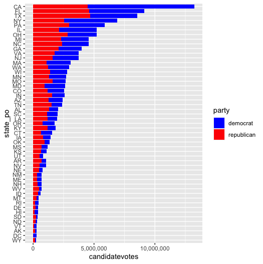
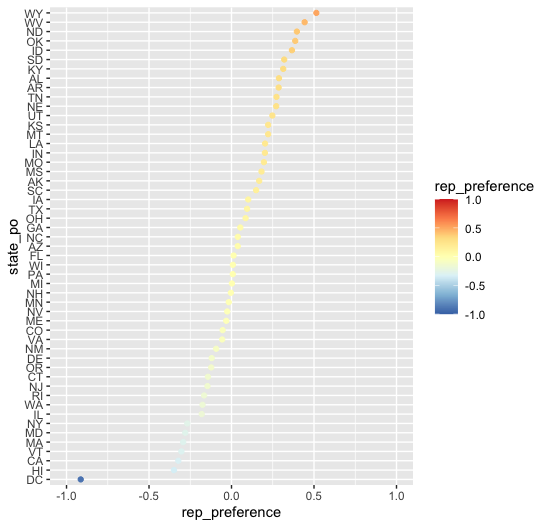

```{r setup, echo=FALSE}
knitr::opts_chunk$set(message = FALSE, warning = FALSE)
```

## ¿Qué vamos a hacer?

En el fastbook anterior vimos unos conceptos básicos sobre visualización de datos. Además, creamos nuestros primeros gráficos utilizando ggplot en R.

En este nuevo fastbook vamos a profundizar sobre algunos elementos de los gráficos: las escalas, sus ejes, los sistemas de coordenadas y las transformaciones estadísticas innatas en algunos tipos de gráficos.

Al terminarlo, seremos capaces de representar en ggplot la gran mayoría de gráficos que necesitemos durante un análisis exploratorio.

## 1. Escalas

### ¿Cuándo necesitamos modificar la escala? Un ejemplo con logaritmos

En el anterior fastbook vimos una actividad que consistía en pintar la evolución del número de votos de los dos principales partidos de EEUU (republicanos y demócratas) a lo largo del tiempo. Pongamos que, además, queremos pintar también la evolución de los dos siguientes partidos: el partido libertario y los verdes.

Podríamos hacer algo así:

```{r}
library(ggplot2)
library(dplyr)

usa_president <- read.csv("dat/usa_president.csv")

usa_president_by_year <- usa_president %>%
  filter(party %in% c("democrat", "republican", "libertarian", "green"),
         writein == FALSE) %>%
  group_by(year, party) %>%
  summarise(candidatevotes = sum(candidatevotes)) %>%
  arrange(desc(candidatevotes))

ggplot(usa_president_by_year, aes(x = year, y = candidatevotes, color = party)) +
  geom_line()
```

¿Qué le pasa a este gráfico? Como hay mucha diferencia en número de votos entre los primeros dos partidos y los dos siguientes, no podemos apreciar apenas la evolución en número de votos del tercero y cuarto partidos.

Podemos arreglar esto mediante el uso de logaritmos. Por ejemplo, así:

```{r}
ggplot(usa_president_by_year, aes(x = year, y = log10(candidatevotes), color = party)) +
  geom_line()
```

Ya vemos mejor la evolución temporal de libertarios y verdes. Pero sigue sin estar bien del todo. Para hacer la transformación en número de votos año a año, tenemos que hacer la cuenta mentalmente mirando el eje y. Donde pone 5, como es el logaritmo con base 10, el dato original es 10^5, es decir, 100.000; 10^6 será 1 millón. Y así...

Sería más útil tener directamente la unidad transformada en los ejes. Para hacer esto, podemos utilizar las funciones `scale_xxx` de ggplot. En este caso, necesitamos transformar la escala de `y` con `log10`. La función que lo realiza es `scale_y_log10`. De esta forma:

```{r}
ggplot(usa_president_by_year, aes(x = year, y = candidatevotes, color = party)) +
  geom_line() +
  scale_y_log10()
```

> Prueba el autocompletado para listar todos los tipos de modificaciones que podemos aplicar a nivel escala, escribiendo en la consola `scale_` y luego pulsando el tabulador.

Y si queremos rematar la forma de mostrar el eje y: en el gráfico anterior, las etiquetas se muestran utlizando la notación científica: 1e+05, 1e+06, ... que, aunque breve, no es muy amigable para la mayoría de los usuarios. Podemos personalizar esto último y mostrar los números completos especificando el formateo de las etiquetas del eje y. Para esto y más cosas, nos servirá tener instalado el paquete `scales`.

```{r}
# Descomenta la siguiente línea en el caso de que no lo tengas instalado
# install.packages("scales")
```

Y ya podemos especificar que utilice la notación "separación por comas" en lugar de la científica.

```{r}
ggplot(usa_president_by_year, aes(x = year, y = candidatevotes, color = party)) +
  geom_line() +
  scale_y_log10(labels = scales::comma)
```

> Fíjate aquí cómo hemos utilizado el objeto `comma` dentro del paquete `scales`. En R podemos utilizar objetos y funciones de otros paquetes de dos formas diferentes: o cargando el paquete en el entorno mediante `library(scales)` y luego utilizando el objeto `comma`, o sin tener que cargar el paquete pero prefijando su nombre y dos puntos, como acabamos de hacer con `scales::comma`.

### Escalas por defecto

Revisa cómo hemos especificado la escala que modifica el eje y: la función ha sido `scale_y_log10`. En ggplot, tenemos disponibles una serie de funciones cuyo nombre sigue este patrón: `scale_<atributo>_<tipo_escala>`. ggplot usa una escala por defecto para cada atributo dependiendo del tipo de dato que le pasemos. Repasemos el gráfico original:

```{r}
ggplot(usa_president_by_year, aes(x = year, y = candidatevotes, color = party)) +
  geom_line()
```

Tenemos 3 propiedades, y a cada una ggplot le ha asignado una escala por defecto:

* `x`: sobre los valores de los años. Como son un valor numérico, ggplot le asigna una escala continua.
* `y`: sobre los valores de votos. De igual manera, como son valor numérico, por defecto tiene una escala continua.
* `color`: el color de la línea, sobre los diferentes valores de partidos. Como son un valor de cadena de caracteres (o también podría ser un factor), tiene una escala de colores cualitativa (en ggplot, se les llama discretas).

> Si quieres recordar los principales tipos de escalas de colores que existen, repasa el fastbook 1.

Una forma de probar si hemos acertado en las escalas que creemos que se usan por defecto es especificarlas y comprobar si el gráfico resultante es el mismo. En este caso:

```{r}
ggplot(usa_president_by_year, aes(x = year, y = candidatevotes, color = party)) +
  geom_line() +
  scale_x_continuous() +
  scale_y_continuous() +
  scale_color_discrete()
```

### Escalas de colores: paletas

Vamos a profundizar más en las escalas de colores. En la actividad 3 del fastbook 1 comprobaste que ggplot utiliza diferentes escalas de colores por defecto dependiendo del tipo de dato. Aunque en general este comportamiento por defecto suele producir un resultado satisfactorio, podemos sobrescribirlo si lo necesitamos para nuestro caso concreto.

Por ejemplo, en el caso de la evolución del número de votos por partido en EEUU: estamos acostumbrados a identificar cada partido a un color concreto:

* Demócratas: azul
* Republicanos: rojo
* Libertarios: oro
* Verdes: verde

Para hacerlo, podemos definir una paleta de colores manual, en la que nosotros especificamos qué valor corresponde a qué color:

```{r}
# Para definir el color que debe tomar cada valor, podemos crear
# un valor con nombres que utilizaremos en la paleta.
# Los valores pueden ser los nombres del color o su valor hexadecimal
parties_palette <- c("democrat" = "blue", "republican" = "red", "libertarian" = "gold", "green" = "darkgreen")

ggplot(usa_president_by_year, aes(x = year, y = candidatevotes, color = party)) +
  geom_line() +
  scale_y_log10(labels = scales::comma) +
  scale_color_manual(values = parties_palette)
```

> Ejercicio: prueba a sustituir la escala manual en los partidos por una cualitativa de tu elección de [colorbrewer](http://colorbrewer2.org/). Para ello, puedes utilizar la función `scale_color_brewer(palette = "nombre_de_la_paleta")`.

### Escalas con fechas

Es muy habitual representar la evolución de una serie de valores a lo largo del tiempo. Para ello, ggplot dispone de las escalas `date` (para fechas) y `datetime` (para fechas con información de horas, minutos, segundos, ...).

Si tenemos las columnas de nuestro dataset correctamente tipadas (las fechas como `Date`, las fechas con información horaria como `POSIXct`), ggplot utilizará la escala correspondiente por defecto. Pero es muy útil saber la que está usando por si queremos sobrescribirla o alterar alguno de sus parámetros.

En `dat/defunciones_espana.csv` tenemos la serie temporal de las defunciones ocurridas en España del 1 de agosto de 2019 hasta el 1 de agosto de 2020, según el sistema de vigilancia de la mortalidad MoMo (más información sobre los datos [aquí](https://momo.isciii.es/public/momo/dashboard/momo_dashboard.html)).

Vamos a leer el CSV y pintar la evolución de la mortalidad en ese periodo.

```{r}
defunciones <- read.csv("dat/defunciones_espana.csv")
head(defunciones)
```

Intentamos pintar la evolución con:

```{r}
ggplot(defunciones, aes(x = fecha_defuncion, y = defunciones_observadas)) +
  geom_line()
```

Algo no está funcionando bien. ¿Qué ha pasado? Podríamos intentar hacer debug de nuestro gráfico utilizando geom_point en lugar de geom_line, y solo el `head()` de los datos en lugar de todas las filas.

Lo que ocurre es que fecha_defuncion es una cadena de texto (o factor).

```{r}
sapply(defunciones, class)
```

Si queremos que se pinte una línea continua, y que el eje x se muestre correctamente, debemos tipar a `Date` la columna.

```{r}
# Convertimos la cadena de caracteres a fecha.
# Como está en formato yyyy-mm-dd (ISO), la conversión con as.Date(...) es directa
defunciones <- defunciones %>%
  mutate(fecha_defuncion = as.Date(fecha_defuncion))

# Comprobamos que los tipos sean los correctos ahora
sapply(defunciones, class)
```

Y volvemos a probar a pintar el mismo gráfico.

```{r}
ggplot(defunciones, aes(x = fecha_defuncion, y = defunciones_observadas)) +
  geom_line()
```

Si miramos en el [panel de MoMo](https://momo.isciii.es/public/momo/dashboard/momo_dashboard.html#nacional), además de la mortalidad observada, muestran la esperada con un intervalo de confianza alrededor. Además, los ticks en el eje x son más frecuente y con otro formato. Vamos a intentar reproducir estas dos características en nuestro gráfico.

ggplot nos permite añadir tantas formas geométricas como necesitemos sobre un gráfico. Nos faltaría:

* Una línea para la mortalidad esperada
* Una banda alrededor de esta mostrando el intervalo de confianza

> Continuamente nos encontraremos con problemas que no sabemos resolver. En este punto, puede que no sepas de primeras cómo pintar una banda para un intervalo de confianza con ggplot. Poco a poco sabrás cómo formular preguntas en google para encontrar rápidamente la solución, consultando en foros como stackoverflow o documentación oficial del paquete en cuestión. Si buscas "ggplot confidence interval band" encontarás fácilmente que la forma geométrica que necesitas es `geom_ribbon`. Consulta su ayuda para utilizarla correctamente.

Por lo tanto, para añadir estos dos elementos, incluimos un `geom_line` para las defunciones esperadas y un `geom_ribbon` para el intervalo de confianza (cuantil 0.01 a cuantil 0.99).

```{r}
ggplot(defunciones, aes(x = fecha_defuncion)) +
  geom_line(aes(y = defunciones_observadas)) +
  geom_line(aes(y = defunciones_esperadas)) +
  geom_ribbon(aes(ymin = defunciones_esperadas_q01, ymax = defunciones_esperadas_q99))
```

¿Qué problema vemos ahora? Tenemos todo en negro: las defunciones observadas, las esperadas y su intervalo de confianza. Así no podemos distinguir correctamente las series. Vamos a arreglarlo de la siguiente forma:

* Utilizando colores diferentes: negro para las observadas, azul para las esperadas y su intervalo de confianza.
* Vamos a bajar la opacidad (o lo que es lo mismo, subir el _alpha_) al intervalo de confianza para que permita ver el grid de fondo.
* Vamos a poner atrás del todo el intervalo de confianza, para que no tape las líneas que tiene detrás.

```{r}
ggplot(defunciones, aes(x = fecha_defuncion)) +
  geom_ribbon(aes(ymin = defunciones_esperadas_q01, ymax = defunciones_esperadas_q99),
              fill = "blue", alpha = 0.3) +
  geom_line(aes(y = defunciones_observadas), color = "black") +
  geom_line(aes(y = defunciones_esperadas), color = "blue")
```

Vamos a fijarnos en varios detalles de este gráfico:

* Hemos movido el `aes(...)` de la parte superior (argumento de ggplot) a su geometría (argumento de `geom_xxxx`). El mapeo de estéticos funciona como una jerarquía: lo definido en el padre (argumentos de ggplot) lo heredan las geometrías. Por eso todas utilizan `y = fecha_defuncion`. Pero cada una puede sobrescribir el valor que necesite, como en este caso. Lo habitual es poner lo común a todas las geometrías como argumento de ggplot y lo específico de cada geometría en su `geom_xxxx` concreto.

* Hemos puesto algunos valores estéticos fuera del mapeo de aes. Recuerda que dentro de `aes(...)` solo van aquellos que se mapean con columnas de nuestros datos. Sacamos fuera aquellos que son constantes (en este caso, las defunciones observadas son siempre en negro, y las esperadas siempre en azul)

* Nos puede confundir que a veces se utiliza `fill` y a veces `color` para especificar el color. En general, `color` suele ser para colores cuando solo hay uno posible (geometrías de puntos, de líneas, ...). Cuando hay varios posibles (color del borde y color del relleno), `color` es del borde y `fill` del relleno. Nos daremos cuenta si utilizamos sin querer `color` en lugar de `fill`, puedes probar a cambiarlo en `geom_ribbon` del gráfico anterior.

Otra cosa que podemos personalizar es la cantidad de etiquetas en los ejes (también llamados ticks o breaks) y su formato. Lo haremos, sobre la función `scale_x_date` con los argumentos `date_breaks` y `date_labels`.

```{r}
ggplot(defunciones, aes(x = fecha_defuncion)) +
  geom_ribbon(aes(ymin = defunciones_esperadas_q01, ymax = defunciones_esperadas_q99),
              fill = "blue", alpha = 0.3) +
  geom_line(aes(y = defunciones_observadas), color = "black") +
  geom_line(aes(y = defunciones_esperadas), color = "blue") +
  scale_x_date(date_breaks = "1 month", date_labels = "%b-%y")
```

> Puedes consultar en la ayuda de `?scale_x_date` cómo personalizar más la apariencia de la escala.

## 2. Transformaciones estadísticas. 

Algunos gráficos, como los de puntos, no necesitan transformaciones: cada punto es representado en el x e y que indican sus valores originales. En cambio, hay otros gráficos que sí requieren algún tipo de transformación estadística, como: histogramas, boxplots, líneas de tendencia, ...

En ggplot, esto se traduce de la siguiente forma: cada forma geométrica `geom_xxxx` tiene su transformación estadística por defecto `stat_xxxx`. La estadística que respeta el valor original (es decir, no realiza transformaciones) es `stat_identity`.

Podemos comprobar la transformación estadística mirando el valor por defecto de su argumento `stat`:

```{r}
args(geom_point)
```

```{r}
args(geom_histogram)
```

> Esto también se puede consultar en la ayuda, p.e. con `?geom_point`.

### Histogramas

Los histogramas cuentan la cantidad de observaciones en rangos, para poder observar su distribución. La función en ggplot es `geom_histogram`.

Por ejemplo, si queremos ver la distribución de pingüinos por peso, podemos mostrar un histograma sobre esa columna de la siguiente forma.

```{r}
library(palmerpenguins)

ggplot(penguins, aes(x = body_mass_g)) + 
  geom_histogram()
```

> Ejercicio: por defecto, se utilizan 30 barras. Elige otro valor sobrescribiendo `bindwidth` o `bins`. ¿Qué es cada uno de estos dos parámetros?

### Gráficos de barras

Aunque los gráficos de barras parecen simples, suelen tener una transformación estadística: un conteo de observaciones por grupo. La función en ggplot es `geom_bar`.

Si queremos ver la cantidad de pingüinos por cada especie que tiene el dataset, podemos hacer:

```{r}
ggplot(penguins, aes(x = species)) + 
  geom_bar()
```

> Investiga qué hace `geom_col`. Replica el gráfico anterior utilizando `geom_col`. Puede que necesites manipular el dataset previamente.

### Líneas de tendencia

Otra transformación estadística habitual son las líneas de tendencia. Son pequeñso modelos de predicción que intentan explicar la relación entre x e y.

Esta línea de tendencia se calcula y representa mediante `geom_smooth`.

Por ejemplo, si queremos mostrar mediante una línea la posible relación entre la longitud de la aleta y el peso de los pingüinos de nuestro dataset, podemos hacer:

```{r}
ggplot(penguins, aes(x = body_mass_g, y = flipper_length_mm)) +
  geom_point() +
  geom_smooth()
```

> Explora las diferentes opciones que puede tomar el argumento `method` de `?geom_smooth`. Prueba a cambiarlo en el gráfico anterior por otros valores: lm, ...

### Boxplots y violines

Una forma habitual de mostrar la distribución de una variable respecto a otras es utilizar boxplots. Si no recuerdas exactamente cómo funcionan los elementos descriptivos de un boxplot, consulta la sección específica del fastbook 1.

Si queremos representar la distribución del peso de un pingüino en función de cada especie observada, podemos utilizar boxplots de la siguiente forma:

```{r}
ggplot(penguins, aes(x = species, y = body_mass_g)) +
  geom_boxplot()
```

> Ejercicio: añade al gráfico anterior el sexo mediante un color para ver la distribución por especie y sexo.

Los boxplots tienen el siguiente problema: no todo el mundo los entiende. Nosotros hemos visto lo que significa cada una de las líneas horizontales (cuartiles), los puntos más alejados (outliers), ... pero si no lo sabes, puede resultar confuso.

Una alternativa son los violines, que muestran la distribución por anchuras en lugar de mediante cuartiles, y quizás puedan ser más amigables.

```{r}
ggplot(penguins, aes(x = species, y = body_mass_g)) +
  geom_violin()
```

> Otra alternativa que se usa a veces, sobre todo cuando hay muchas clases diferentes sobre la que mostrar la distribución, son los joyplots. Toman este nombre por la portada del album [_Unkown pleasures_ de _Joy Division_](https://en.wikipedia.org/wiki/Unknown_Pleasures). Puedes ver un ejemplo de uso [aquí](http://www.sthda.com/english/articles/16-r-packages/30-ggjoy-create-a-ggplot2-based-joyplots/). Instala el paquete y pinta un joyplot para el ejemplo anterior.

## 3. Sistemas de coordenadas

En todos los gráficos que hemos estado pintando, hay un sistema de coordenadas. El de por defecto que usa ggplot es `coord_cartesian`. Pero podemos alterarlo con diferentes propósitos.

A veces, es más fácil leer e interpretar los gráficos intercambiando los ejes, con `coord_flip`.

```{r}
ggplot(penguins, aes(x = species)) + 
  geom_bar() +
  coord_flip()
```

Y si pintamos mapas, el sistema de coordenadas por defecto deformará las dimensiones:

```{r}
# Descomenta la siguiente línea si no tienes el paquete maps instalado
# install.packages("maps")

italy <- map_data("italy")

ggplot(italy, aes(x = long, y = lat, group = group)) +
  geom_polygon(fill = "white", color = "black")
```

> Fíjate (igual que en el ejemplo de las defunciones) que cuando los valores estéticos son constantes (en este caso, queremos que el color de relleno sea siempre blanco, y el color de la línea sea siempre negro) van fuera del mapeo de aes. Es un error muy habitual ponerlo dentro sin querer. Prueba a ponerlo dentro de aes y observa lo que pasa. ¿Sabrías explicar por qué?

Para respetar una proyección a la que estemos habituados, podemos utilizar `coord_map` o `coord_quickmap`.

```{r}
ggplot(italy, aes(x = long, y = lat, group = group)) +
  geom_polygon(fill = "white", color = "black") +
  coord_quickmap()
```

> En el siguiente fastbook profundizaremos en la creación de mapas con ggplot, pero puedes consultar la diferencia entre `coord_map` y `coord_quickmap` en la ayuda.

Y por último, tenemos otros sistemas de coordenadas además del cartesiano, como el polar. Aunque son mucho menos frecuentes de usar.

```{r}
ggplot(penguins, aes(x = species, fill = species)) +
  geom_bar(width = 1) +
  coord_polar()
```

## 4. Zoom

Podemos controlar los límites de los gráficos mediante varias técnicas:

* Filtrar previamente los datos a pintar
* Controlar los `limits` de un eje
* Controlar `xlim` e `ylim` de las coordenadas

Controlar los límites (ya sea mediante los ejes o las coordenadas) para hacerlos más pequeños es equivalente a filtrar previamente los datos por las columnas que sea mapean con `x` y/o `y`.

Un caso de uso habitual para expandir los límites es hacer que varios gráficos con diferentes datos usen el mismo mínimo y máximo en sus ejes para que sean comparables (aunque más adelante veremos el uso de _facets_ para algo similar).

```{r}
penguins %>%
  filter(species == "Adelie") %>%
  ggplot(aes(x = body_mass_g, y = flipper_length_mm)) +
  geom_point() +
  coord_cartesian(xlim = c(2500, 6500), ylim = c(170, 240))
```


```{r}
penguins %>%
  filter(species == "Gentoo") %>%
  ggplot(aes(x = body_mass_g, y = flipper_length_mm)) +
  geom_point() +
  coord_cartesian(xlim = c(2500, 6500), ylim = c(170, 240))
```

> Fíjate como hemos utilizado `%>%` y `+` aquí. ¿Por qué funciona correctamente?

La otra alternativa sería utilizar limits de cada una de las escalas:

```{r}
penguins %>%
  filter(species == "Adelie") %>%
  ggplot(aes(x = body_mass_g, y = flipper_length_mm)) +
  geom_point() +
  scale_x_continuous(limits = c(2500, 6500))+
  scale_y_continuous(limits = c(170, 240))
```

## Profundiza

Para saber más sobre los conceptos que hemos visto, puedes consultar alguna de estas referencias:

* [Chuleta de ggplot](https://github.com/rstudio/cheatsheets/raw/master/data-visualization-2.1.pdf): sintetiza las funciones más habituales para ggplot. Muy útil para tener a mano a la hora de utilizar la librería.
* [Visualización de datos con ggplot](https://r4ds.had.co.nz/data-visualisation.html) disponible en el libro online de R for Data Science.
* [Exploratory data analysis](https://r4ds.had.co.nz/exploratory-data-analysis.html) también disponible en el libro online de R for Data Science.
* [R Graphics Cookbook de Winston Chang](https://www.amazon.com/dp/1491978600/) con recetas para pintar los gráficos más habituales.
* [ggplot2: Elegant Graphics por Data Analyisis](https://www.amazon.com/ggplot2-Elegant-Graphics-Data-Analysis/dp/331924275X/ref=as_li_ss_tl?ie=UTF8&linkCode=sl1&tag=ggplot2-20&linkId=4b4de5146fdafd09b8035e8aa656f300) profundiza sobre el uso de ggplot para realizar gráficos más avanzados y personalizados. El código fuente del libro está disponible en [github](https://github.com/hadley/ggplot2-book).

## Conclusiones

Nos podemos quedar con las siguientes ideas como resumen de este tema:

* Los elementos estéticos (x, y, color de línea, color de relleno, opacidad, etc) que deben mapearse con columnas del dataset, se ponen dentro de `aes(...)`. Los que deben tomar valores fijos, los sacamos fuera y son argumentos directos de `geom_xxxx`.
* Las escalas por defecto que usa ggplot dependen del tipo de dato de nuestro dataset, pero podemos sobrescribirlas con las funciones `scale_xxxx`.
* Algunos gráficos utilizan transformaciones estadísticas internamente, con las funciones `stat_xxxx` de ggplot.
* Los histogramas son útiles para observar la distribución de una variable.
* Los boxplots (`geom_boxplot`) o gráficos de violín (`geom_violin`) son útiles para ver la distribución de una variable respecto a otras.
* Es habitual tener que manipular (filtrar, agrupar, ...) el dataset antes de pintar el gráfico que queremos.

## Actividades

### Actividad 1

Rescata el gráfico que hiciste en el fastbook anterior, pero añadiendo el tercer punto aquí detallado.

1. Lee los datos del economista (dat/economist.csv), con indicadores de desarrollo y corrupción por países:

* HDI: Human Development Index (1: más desarrollado)
* CPI: Corruption Perception Index (10: menos corrupto)

2. Crea un gráfico que:

* Cada país sea un punto
* El eje `x` indique CPI, el `y` HDI
* El color del punto indique la región
* Su tamaño sea proporcional al ranking HDI

3. Pinta una línea de tendencia que muestre la relación entre el CPI y el HDI (entre el eje `x` y el eje `y`)

### Actividad 2

1. Lee los datos de las elecciones presidenciales de EEUU (dat/usa_president.csv)

2. Quédate únicamente con los datos de las elecciones de 2016, con los resultados de los partidos demócrata y republicano, y con las filas con writein = FALSE.

3. Quédate con el número de votos demócratas y republicanos para cada estado.

4. Pinta un gráfico de barras apiladas. Bonus: ordénalo por total de votos

El resultado final será algo así:



### Actividad 3

1. Lee los datos de las elecciones presidenciales de EEUU (dat/usa_president.csv)

2. Como antes, quédate únicamente con los datos de las elecciones de 2016, con los resultados de los partidos demócrata y republicano, y con las filas con writein = FALSE.

3. Calcula para cada estado, una columna nueva que se llame `rep_preference` definida como `(votos_republicanos / (votos_republicanos + votos_democratas) - 0.5) * 2` . Esta columna tendrá valores cercanos al 0 para estados donde hubo un resultado cercano al empate, acercándose al 1 si ganaron los republicanos y acercándose al -1 si ganaron los demócratas. Nota: puede que te resulte útil separar los datos en dos datasets (votos republicanos y votos demócratas) y luego unirlos.

4. Pinta un gráfico de puntos, en el eje `y` el estado (la abreviatura de dos caracteres) y en el eje `x` el valor de `republican_preference`. El color del punto será una escala divergente, en la que a mayor victoria republicana sea más rojo (valor más positivo), mayor victoria demócrata más azul (valor más negativo), y los cercanos al empate sean blancos o amarillos (valor más cercano al cero).

8. Ordena los estados por `rep_preference` y centra el 0 en mitad del gráfico.

9. Centra el cero en mitad del eje x

10. Centra el cero en el valor neutro de la escala de colores

El resultado final será algo así:



> Consulta la ayuda de `?scale_colour_brewer`, especialmente para qué sirve la variación `_distiller`.

### Actividad libre

Coge algún dataset de tu interés (por ejemplo, alguno de los que hemos usado hasta ahora: `diamonds`, `penguins`, ... o de otra asignatura) y explóralo mediante gráficos: histogramas, gráficos de puntos, barras, ...
