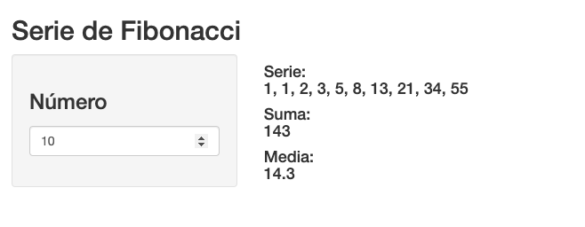
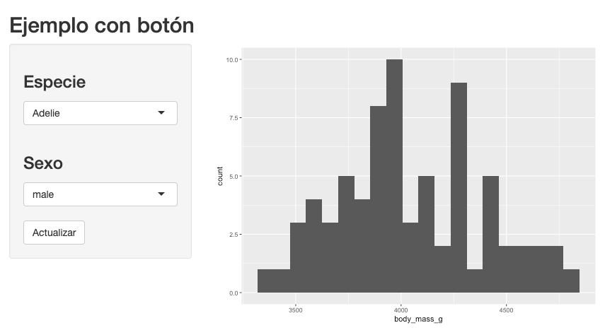

```{r setup, echo=FALSE}
knitr::opts_chunk$set(message = FALSE, warning = FALSE)
```

## ¿Qué vamos a hacer?

En el _fastbook_ anterior empezamos a utilizar Shiny para crear aplicaciones web interactivas. Aprendimos a crear una interfaz gráfica y un servidor que reaccione ante las acciones del usuario.

En este nuevo _fastbook_ profundizaremos sobre la reactividad en Shiny y veremos ejemplos de uso más avanzados. Te resultará muy útil tener a mano la [chuleta de Shiny](https://shiny.rstudio.com/images/shiny-cheatsheet.pdf).

Este _fastbook_, al igual que el anterior, viene acompañado de una carpeta de ejemplos, que deberás tener a mano para poder ejecutar las aplicaciones que iremos viendo.

## Reactividad

### Entradas, salidas y conductores

La reactividad es el pegamento entre los _inputs_ de usuario y los _outputs_ generados como resultado. Una salida reactiva es aquella que genera su resultado automáticamente cuando un usuario cambia el valor de algún control.

Existen tres tipos de objetos en la programación reactiva:

* La entrada, implementada en _Shiny_ con el objeto `input`.
* La salida, implementada con el objeto `output`.
* El conductor (opcional), implementada con la funcion `reactive`. Son componentes que se colocan entre las entradas y las salidas. Se suelen utilizar para encapsular operaciones computacionalmente costosas y evitar que se re-evalúen más veces de las necesarias. Veremos un ejemplo de uso un poco más adelante.

Cuando el valor de alguna entrada cambia, provoca que se re-calculen todas las salidas (y, opcionalmente, conductores) que dependan de ella.

Vamos a fijarnos en uno de los ejemplos del anterior _fastbook_:

```
library(shiny)
library(palmerpenguins)
library(plotly)

# La interfaz gráfica
ui <- fluidPage(
  
  # El título de la aplicación
  titlePanel("Distribución de las propiedades de los pingüinos"),
  
  # Un panel que tiene una zona más pequeña en el lateral izquierdo,
  # y un panel principal más grande a la derecha
  sidebarLayout(
    
    # Usaremos el panel izquierdo para los inputs
    sidebarPanel(
      
      # Input de tipo select sobre una lista de opciones
      selectInput(
        inputId = "property",
        label   = "Propiedad",
        choices = list("Longitud del pico"    = "bill_length_mm",
                       "Profundidad del pico" = "bill_depth_mm",
                       "Longitud de la aleta" = "flipper_length_mm",
                       "Peso"                 = "body_mass_g")
      )
      
    ),
    
    # El panel principal con los outputs
    mainPanel(
      
      # El histograma
      plotlyOutput(outputId = "histogram")
      
    )
  )
)

# El servidor
server <- function(input, output) {
  
  # Genera el histograma sobre la propiedad seleccionada
  output$histogram <- renderPlotly({
    plot_ly(penguins, x = ~get(input$property), type = "histogram", nbinsx = input$bins) %>%
      layout(xaxis = list(title = "Propiedad"))
  })
  
}

# Generamos la aplicación
shinyApp(ui = ui, server = server)
```

En este caso:

* La entrada es la variable con ID `property`. Se recoge a través de un `select` en la interfaz.
* La salida es la variable con ID `histogram`. Es un gráfico generado en el servidor, y definido en la interfaz. La función se ejecuta cada vez que cambia su única variable de entrada, `property`.

Aquí no hay ningún componente de tipo conductor. Vamos a ver un caso en el que nos resultará útil implementar uno.

Vamos a hacer una calculadora de la serie de Fibonacci. La serie de Fibonacci es la que resulta de sumar los dos números previos: 1, 1, 2, 3, 5, 8, 13, ... A partir de cierta longitud, empieza a ser pesada computacionalmente.

A nuestra aplicación le pasaremos hasta qué número de la serie calcular, y nos devolverá las siguientes tres cosas: la serie hasta ese número, lo que suman todos los números de la serie, y su media.

Una primera aproximación para hacerlo sería esta:

```
library(shiny)

# Función para calcular el enésimo número de la serie de fibonacci
fibonacci <- function(n) {
  if (n < 1) {
    return(NA)
  }
  if (n < 3) {
    return(1)
  }
  fibonacci(n - 1) + fibonacci(n - 2)
}


# La interfaz gráfica
ui <- fluidPage(
  
  # El título de la aplicación
  titlePanel("Serie de Fibonacci"),
  
  # Un panel que tiene una zona más pequeña en el lateral izquierdo,
  # y un panel principal más grande a la derecha
  sidebarLayout(
    
    # Usaremos el panel izquierdo para los inputs
    sidebarPanel(
      
      # Input de tipo slide
      numericInput(inputId   = "numero",
                   label     = h3("Número"),
                   value     = 10,
                   min       = 1,
                   max       = 30),

    ),
    
    # El panel principal con los outputs
    mainPanel(
      
      h4("Serie: ", textOutput(outputId = "serie")),
      h4("Suma: ",  textOutput(outputId = "suma")),
      h4("Media: ", textOutput(outputId = "media")),
      
    )
  )
)

# El servidor
server <- function(input, output) {
  
  # El output serie contiene toda la serie
  output$serie <- renderText({
    serie <- sapply(1:input$numero, fibonacci)
    paste(serie, collapse = ", ")
  })
  
  # El output suma contiene toda la suma de todos los valores de la serie
  output$suma <- renderText({
    serie <- sapply(1:input$numero, fibonacci)
    sum(serie)
  })
  
  # El output media contiene toda la media de todos los valores de la serie
  output$media <- renderText({
    serie <- sapply(1:input$numero, fibonacci)
    mean(serie)
  })
  
}

# Generamos la aplicación
shinyApp(ui = ui, server = server)
```

Puedes lanzar este ejemplo haciendo:

```
library(shiny)
runApp("examples/01_fibonacci_sin_conductor")
```




¿Cuál es el problema de esta implementación? La función de cálculo de la serie de Fibonacci se ejecuta 3 veces cada vez que cambia el número en el _input_, una para cada _output_. Vamos a optimizarla utilizando un conductor, para que solo se evalúe una única vez en cada cambio del valor de _input_.

```
# El servidor
server <- function(input, output) {
  
  # El output serie contiene toda la serie
  output$serie <- renderText({
    serie <- sapply(1:input$numero, fibonacci)
    paste(serie, collapse = ", ")
  })
  
  # El output suma contiene toda la suma de todos los valores de la serie
  output$suma <- renderText({
    serie <- sapply(1:input$numero, fibonacci)
    sum(serie)
  })
  
  # El output media contiene toda la media de todos los valores de la serie
  output$media <- renderText({
    serie <- sapply(1:input$numero, fibonacci)
    mean(serie)
  })
```

Presta atención a cómo hemos definido el conductor. El cálculo debe estar como una expresión dentro de la función `reactive`.

> Si intentas leer algún `input` fuera de funciones reactivas, verás que falla (las funciones reactivas son las de renderPlot, renderText, reactive, ...).

Puedes lanzar este ejemplo haciendo:

```
library(shiny)
runApp("examples/02_fibonacci_con_conductor")
```

> Ejecuta ambos y prueba algún número grande (p.e. 25) y comprueba que tarda menos la implementación con conductor que la sin conductor.

### Control de la reactividad

En todos los ejemplos anteriores, la salida se re-evaluaba al cambiar alguno de los parámetros de entrada. En general, es útil para dar esa sensación de interacción fluida a la aplicación. Pero en algún caso, es posible que no queramos que sea así.

Por ejemplo, imagina una aplicación en la que hay que completar bastantes parámetros de entrada, y la función de cálculo de las salidas es lenta. Cada vez que cambiemos uno de estos _inputs_, la aplicación se quedará calculando los _outputs_. Si tenemos cuatro, cinco valores de entrada, lanzará la evaluación al terminar de completar cada uno de ellos. En estos casos, el comportamiento habitual es esperar a tener todos los valores de entrada rellenos y luego, bajo demanda, evaluar las salidas. La acción para indicar que ya se debe evaluar suele ser un botón.

Vamos a hacer una pequeña aplicación que nos muestra un histograma del peso de los pingüinos en base a los filtros de especie y sexo que escojamos. El histograma se actualizará únicamente al hacer click en un botón, y no automáticamente.

```
library(shiny)
library(palmerpenguins)
library(dplyr)
library(ggplot2)

# Extraigo todas las especies y sexos (distintos de NA) para los select
all_species <- unique(penguins$species)
all_sexes  <- unique(penguins[!is.na(penguins$sex), ]$sex)

# La interfaz gráfica
ui <- fluidPage(
  
  # El título de la aplicación
  titlePanel("Ejemplo con botón"),
  
  # Un panel que tiene una zona más pequeña en el lateral izquierdo,
  # y un panel principal más grande a la derecha
  sidebarLayout(
    
    # Usaremos el panel izquierdo para los inputs
    sidebarPanel(
      
      # Input de tipo select para la especie
      selectInput(inputId = "especie",
                  label   = h3("Especie"),
                  choices = all_species),

      # Input de tipo select para el sexo
      selectInput(inputId = "sexo",
                  label   = h3("Sexo"),
                  choices = all_sexes),
      
      actionButton(inputId = "actualizar", label = "Actualizar")
      
    ),
    
    # El panel principal con los outputs
    mainPanel(
      
      plotOutput("histograma"),
      
    )
  )
)

# El servidor
server <- function(input, output) {
  
  # El output serie contiene toda la serie
  output$histograma <- renderPlot({
    
    # Utilizamos input$calcular (el botón) como dependencia, para que se
    # recalcule al hacer click (fuera de isolate!)
    input$actualizar
    
    # El resto de las dependencias (valores de entrada) las metemos dentro de una expresión
    # de isolate. Con isolate evitamos que se dispare automáticamente la evaluación.
    datos_filtrados <- isolate({
      filter(penguins, species == input$especie, sex == input$sexo)
    })
    
    # Finalmente, el gráfico resultante
    ggplot(datos_filtrados, aes(x = body_mass_g)) +
      geom_histogram(bins = 20)
  })
  
}

# Generamos la aplicación
shinyApp(ui = ui, server = server)
```

Fíjate bien en cómo lo hemos hecho:

* Dentro de la función de servidor para calcular nuestro gráfico de salida, `histograma`, ponemos como dependencia el valor de entrada correspondiente al botón, `actualizar`.
* El resto de valores de entrada dependientes (la especie y el sexo), los metemos dentro de una expresión en la función `isolate`. Al estar dentro de la función, no provocarán la evaluación automática de la salida.

Puedes lanzar este ejemplo haciendo:

```
library(shiny)
runApp("examples/03_action_button")
```



> Ejecuta la aplicación y comprueba que, efectivamente, el histograma no se actualiza cambiando los valores de entrada, sino que espera al click sobre el botón.

## Profundiza

Para saber más sobre los conceptos que hemos visto, puedes consultar alguna de estas referencias:

* [Chuleta de Shiny](https://shiny.rstudio.com/images/shiny-cheatsheet.pdf): muy útil para tener a mano los comandos más habituales de Shiny.
* [Galeria](https://shiny.rstudio.com/gallery/): ejemplos con código y resultado de varios cuadros de mando y aplicaciones desarrolladas con R Shiny.
* [Tutoriales en vídeo](https://shiny.rstudio.com/tutorial/): una serie de tutoriales de todos los niveles sobre el manejo de Shiny.
* [Visión general de la reactividad en Shiny](https://shiny.rstudio.com/articles/reactivity-overview.html): descripción de los diferentes tipos de objetos relacionados con la reactividad: entradas, salidas y conductores.
* [Programación de la ejecución reactiva](https://shiny.rstudio.com/articles/execution-scheduling.html): artículo que detalla el funcionamiento interno de Shiny para re-evaluar los componentes de la aplicacion.
* [Entendiendo la reactividad](https://shiny.rstudio.com/articles/understanding-reactivity.html): profundiza en el funcionamiento de la reactividad, con el objetivo de optimizar las aplicaciones realizadas con Shiny y evitar cometer algunos errores comunes.
* [Prevención de reactividad automática](https://shiny.rstudio.com/articles/isolation.html): artículo sobre el uso de `isolate` y los `actionButtons`.
* [Uso de bases de datos en Shiny](https://shiny.rstudio.com/articles/overview.html): son una serie de artículos que documentan cómo integrar Shiny con bases de datos utilizando _pools_ de conexiones.
* [Personalización del aspecto de las aplicaciones en Shiny](https://shiny.rstudio.com/articles/css.html): detalla cómo personalizar el aspecto de las aplicaciones realizadas con Shiny utilizando un _css_ propio.

## Conclusiones

Nos podemos quedar con las siguientes ideas como resumen de este tema:

* La reactividad hace que se evalúen las salidas según los valores de entrada.
* Por defecto, las salidas se evalúan en cuanto cambia alguna de las entradas de las que dependen.
* Si hay varias salidas que dependen de una función costosa, es recomendable evaluarla una única vez, en lugar de una por salida. Para hacerlo, podemos utilizar los conductores (función `reactive`).
* Podemos evitar que una salida se evalúe cada vez que cambia alguna de sus entradas con la función `isolate`. Y podemos evaluar la salida bajo demanda con un `actionButton`.

## Actividades

### Actividad 1

Partiendo del ejemplo `examples/02_fibonacci_con_conductor`, añade un botón al menú lateral y cambia la implementación para que los resultados se actualicen al pulsarlo, y no al cambiar el parámetro de entrada.

### Actividad 2

Crea una aplicación de shiny para visualizar el porcentaje de voto a cada uno de los partidos en las últimas elecciones.

La aplicación tendrá:

* Como inputs, el listado de partidos disponibles.
* Como outputs:

    * Un mapa de `leaflet` mostrando las provincias, coloreadas según el porcentaje de voto (es decir, los votos a ese partido / los votos válidos en la provincia) obtenido en cada una de ellas. Incluye una leyenda para poder interpretarlo fácilmente.
    * Un gráfico de barras de `plotly` mostrando el número de votos por provincia, ordenado de mayor a menor número de votos.
    
La función de tratamiento y filtrado de los datos para obtener el número de votos (absoluto y porcentual) por provincia al partido seleccionado deberá ejecutarse una única vez, y no repetirse para cada salida.

### Actividad 3

Como comentamos en el _fastbook_ anterior, una aplicación de Shiny necesita de un servidor que esté continuamente corriendo la aplicación, contestando a las peticiones de los usuarios. Lee en [este link](https://shiny.rstudio.com/tutorial/written-tutorial/lesson7/) las diferentes opciones que hay para desplegar aplicaciones en Shiny. Créate una cuenta gratuita en Shinyapps.io y despliega la aplicación de la actividad 2 siguiendo [este tutorial](https://shiny.rstudio.com/articles/shinyapps.html).
